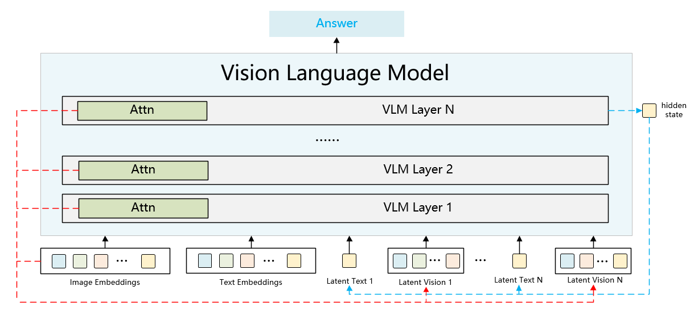

# IVT-LR
Official repository for “Reasoning in the Dark: Interleaved Vision-Text Reasoning in Latent Space” 

## Overview

Interleaved Vision-Text Latent Reasoning (IVT-LR) is the first VLM framework that unifies textual and visual representations in the latent space and implements multimodal latent reasoning. Specifically, IVT-LR represents each reasoning step by combining two implicit parts: ***latent text*** and ***latent vision***. We further introduce a progressive multi-stage training strategy to enable MLLMs to perform the above multimodal latent reasoning steps.



## Getting Started

Clone repo:

```
git clone https://github.com/FYYDCC/IVT-LR.git
cd IVT-LR
```

Setup environment:

```
conda env create -f environment.yml
conda activate ivtlr
```

## Usage

### Training

We provide two experiment setup: Qwen2-VL on M3CoT & Chameleon on ScienceQA

#### Qwen2-VL on M3CoT

To train the Qwen2-VL model with IVT-LR on the M3CoT dataset:

```
cd qwen_vl
export CUDA_VISIBLE_DEVICES=0,1,2,3
export NCCL_P2P_LEVEL=NVL   # if is needed
PYTHONUNBUFFERED=1 nohup deepspeed --master_port 29501 qwenvl_run.py args/qwen.yaml --deepspeed --deepspeed_config ds_config.json > qwenvl.log 2>&1 &
```


#### Chameleon on ScienceQA

For Chameleon:

```
cd chameleon
export CUDA_VISIBLE_DEVICES=0,1,2,3
export NCCL_P2P_LEVEL=NVL   # if is needed
PYTHONUNBUFFERED=1 nohup deepspeed --master_port 29501 chameleon_run_sqa.py args/chameleon.yaml --deepspeed --deepspeed_config ds_config.json > chameleon.log 2>&1 &
```


>To implement Chameleon on M3CoT and Qwen2-VL on ScienceQA, just follow the implementation of the other model as a reference.


#### Arguments

Key parameters in configuration:

- `save_path`: Checkpoint save directory
- `name`: Experiment name
- `epochs_per_stage`: Epochs per latent reasoning stage (default: 4)
- `max_latent_stage`: Maximum latent reasoning stages (default: 5)
- `resume`: Resume epoch number (default: 0)
- `batch_size_training`: Batch size per GPU (default: 4)
- `gradient_accumulation_steps`: Gradient accumulation steps (default: 4)
- `num_epochs`: Total training epochs (default: 16)
- `lr`: Learning rate (default: 4e-5)


### Inference

To generate the answer on the test split, run the inference code.

Qwen2-VL:

```
export CUDA_VISIBLE_DEVICES=0
nohup python infer.py > infer.log 2>&1 &    
```

Chameleon:

```
export CUDA_VISIBLE_DEVICES=0
nohup python infer_chameleon_scienceqa.py > infer.log 2>&1 &    
```


